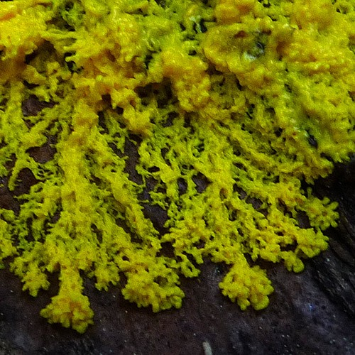
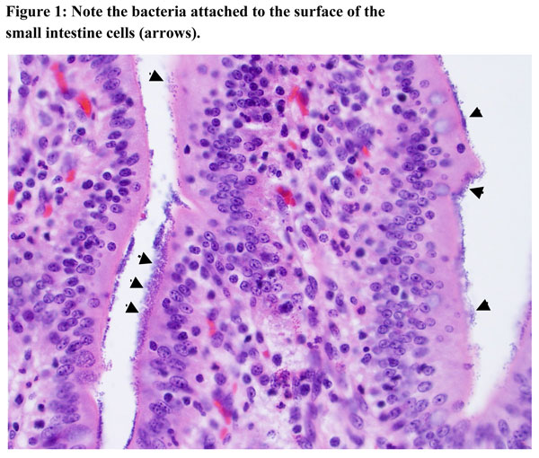
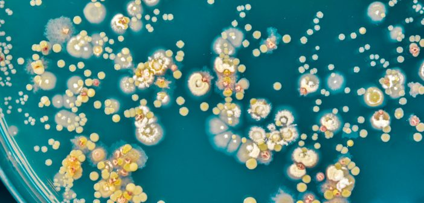
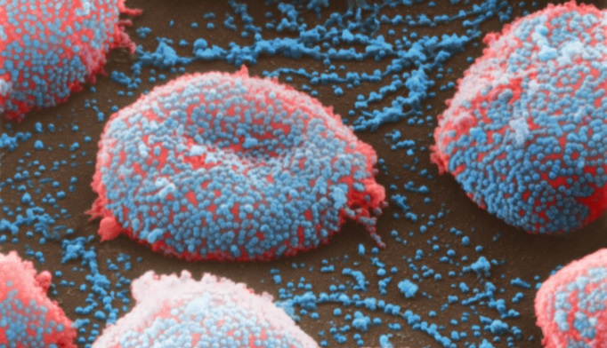

# Midterm

### Artificial Life and Simulation
Our midterm project is to create a virtual ecosystem inhabited by at least two kinds of organisms. The organisms should be visually different and have different behaviors such as ways of moving. Example behaviors include living, dying, sleeping, bleeding, splitting, combining, reproducing, eating (each other or food). They may also interact or have other kinds of behaviors. The ecosystem can include non-living components, or have multiple areas with different forces (such as water, air, etc). You are able to select a specific real ecosystem to model, a species, or a site from film/literature for example. Examples: Ecoli, a particular flock of birds, pigeons, Walden pond, slime mold, Survival Research Laboratories...

Your code must have at least two types of organisms.

Part 1 due October 16. Part 2 due October 28!

### Deliverables:

#### Part 1

* A basic version of your ecosystem is due at the start of class on October 16. Your ecosystem must have at least two virtual creatures with unique appearances, movements and behaviors.
* Be ready to work with this Part 1 version of your assignment in class on October 16.

## Part 2

* Complete the final version of your ecosystem. Consider incorporating additional behaviors, interactions and user inputs to your ecosystem.
* Upload your project to a Github pages site or Glitch.
* Documentation: To explain your project you must make a markdown page or a pdf document that describes your project. This page should include. A title, your name, a description of what happens in your program, a short paragraph of the challenges/surprises your faced in the process, a list of the different species in your system, and at least 3 screen shots showing the evolution of your system. Add captions to these screen shots. This document should also have a link to a live version of this project online and a bibliography listing any references you may have used in the making of this project.
* If you are using github for submissions, add this markdown file as a README.md to your project repository and add to your own course repository online. When submitting via Moodle, link to your project online.

Consider implementing:
* forces
* motion - using gaussian distribution, perlin noise, etc
* drag, friction
* attraction/repulsion

# Due
Week 8 - October 23

