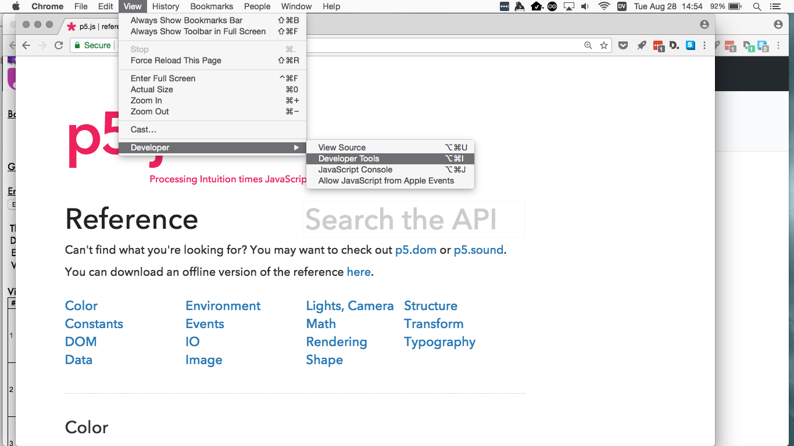
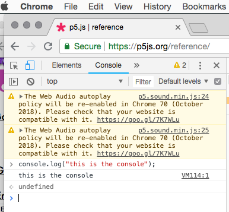

# Week1

* Hello!
* What will we be learning?
* Syllabus / Drawing, Moving, Seeing Code
* P5JS
* Javascript crash course

# Intro to P5JS
* Your first p5 sketch
* Review the [Transitioning from Processing tutorial](https://github.com/processing/p5.js/wiki/Processing-transition)
* [Alpha Editor](http://alpha.editor.p5js.org)
  * register and make an account
* Running p5js sketches locally and setting up your editor

# Javascript!

## Program flow

### A basic p5 `sketch`

```
//this is a comment

function setup(){
  createCanvas(500,500);
}

function draw(){
    //main loop
    //each run of draw is a frame
}
```

### variables

Javascript is [weakly typed](https://en.wikipedia.org/wiki/Strong_and_weak_typing)

```
var x = 0;
let y = 0;
```

### functions

We covered setup and draw. There is also

```
function mousePressed(){}

function keyPressed(){}

function keyTyped(){}
```

##### Working with media (images, sound, etc)

```
function preload(){
  //load media here
  img = loadImage('assets/quality_meme.jpg');
  }  
```

### Input

```
ellipse(mouseX,mouseY,20);
```

Keypresses, mouse movement and clicks are examples of input and interaction

### Looping

Similar to Processing/Java

```
for (var i = 0; i < 10; i++){
  print(i)    // will print 1, 2, 3...to 9 on separate lines
}
```

Don't forget you may see ```let``` instead of ```var```


### arrays

Arrays can be described literally. They always start with 0.

```
let array = ['zeroeth','first','second','last'];

console.log(array[0]); //will print zeroeth to console
```

##### Add to the end of an array with push

```
let numArray = [0, 1, 2];

array.push(3);
array.push(4);
console.log(array); //will result [0, 1, 2, 3, 4]
```

##### Remove from end of array with pop

```
//continuing from above
array.pop();
console.log(array); //will result [0, 1, 2, 3]
```


### classes and objects

Are you still with me?


**Note: These are the most basic parts of the language, and we haven't gotten into ES6 yet. Stay tuned...**

# Debugging and the console

### Accessing the Console



Using the Console



## Code Examples

Code examples in p5js can be found [here](../basicExamples.md)

# Assignment

* Review syllabus
* Get a notebook for class
* Read Zach Lieberman's [Lessons For Students](https://medium.com/@zachlieberman/lessons-for-students-cf1acf200ee), 8 minutes
* Write your first [discovery and research report](../assigmnents.md) on a creative programming tool or environment that is used by artists to make experimental technology based work. Explain what the tool is, who created it and what it does, try to include an example of a project (and link to it) that has been made with it. If you are stuck for ideas on creative coding tools see the list at the end of the resources section of the syllabus. For the first assignment, please email me your response. Next week we will learn how to use github and you will post this to your github page.
* Port one of your old Processing sketches to p5js if you have one, choose a simple animation without objects or libraries....something basic.
* Start your Assignment 1 aka *Tamagotchi project*
  * sketch in notebook. what's it look like? What are all the different states? how will you interact with it? Write about each state.
  * Write out pseudo code for the flow of the program. What will happen in each state? They may have their own flow/loops.
  * Start coding. Get your little being/animal/person/anthropomorphic object onto the screen. Animate its rest state in its own function you call rest. Call it from draw.

#### Due

In-class Week 4

# Javascript Resources

* [W3Schools Javascript tutorial](https://www.w3schools.com/js/default.asp)
* [Eloquent Javascript book](https://eloquentjavascript.net/)
