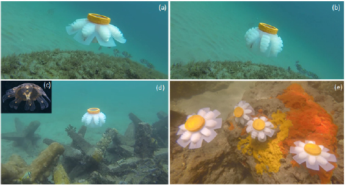
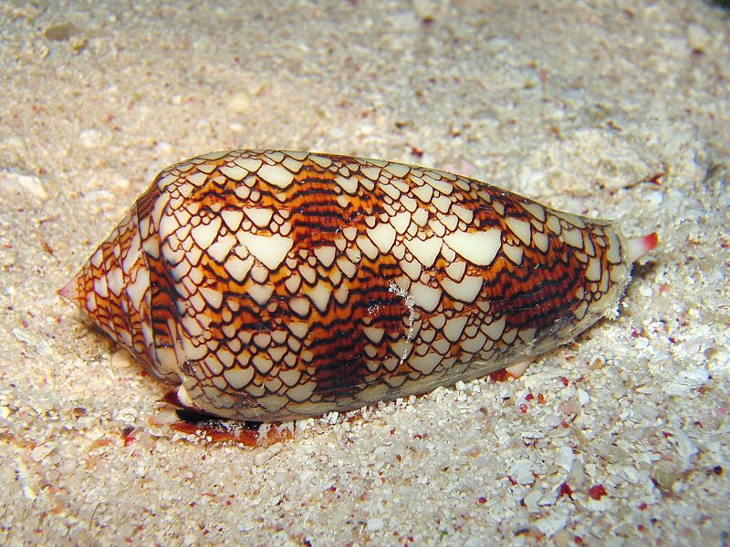

# Week 8

# Update to our syllabus

Based on our class discussion last week, I will have the next phase of our course (after the ecosystem project) cover more on javascript, data and APIs, as well as hosting projects on servers and interoperating on other services. We will also look at procedural generation and hereditary systems. Students will pick areas of interest to research and study, both technical as well as theoretical. For the final project, students can choose to create a p5 project or research and produce a-life, emergence and behavioral mimicry projects in javascript, physical computing or Unity. (Examples: a cellular automata synthesizer, a network of interoperating twitter bots that remix each other's art, a Roomba that dances with humans...)

# Start a Things to Learn File

### Examples

* How to make a twitter bot that posts images or generated text
* How to access Google maps API
* How to access live weather data or other data and have it influence visuals in a p5js sketch
* How to publish a web app to Glitch, Amazon AWS, Heroku, Digital Ocean, etc

### Emergence: A Magazine of emergent life and artforms

We'll publish an ezine (and maybe a riso?) with articles on emergence, a-life and other related or unrelated concepts.

#### Concepts to study

* Turing complete
* Procedural Generation
* Cellular Automata

# Physical Computing A-life

  
*Hexapod (land jellyfish) by Zenta*

  
*Soft robot jellyfish by Jennifer Frame + team*

# Particle Systems

* p5js [example code](https://github.com/shiffman/The-Nature-of-Code-Examples-p5.js/tree/master/chp04_systems) from The Nature of Code
* Daniel Shiffman particle system [tutorial videos](https://www.youtube.com/watch?v=vdgiqMkFygc&list=PLRqwX-V7Uu6Z9hI4mSgx2FlE5w8zvjmEy)

> “A particle system is a collection of many many minute particles that together represent a fuzzy object. Over a period of time, particles are generated into a system, move and change from within the system, and die from the system.” —William Reeves, "Particle Systems—A Technique for Modeling a Class of Fuzzy Objects," ACM Transactions on Graphics 2:2 (April 1983)

* used to model irregular types of natural phenomena such as fire, smoke, waterfalls, fog, grass, bubbles, etc.

#### Why use particle systems

* for tracking many things
* as opposed to an array, a particle system allows for flexibility in size - it can increase, decrease elements, or shrink to 0
* particles are independent. They can be created or die separate from the rest of the flock.

## A single particle

**A single particle object is just another name for our *mover*. A particle has a positon, velocity and acceleration.**

We can start with the basics of the mover class we made earlier. Now we'll add one more method to the class called lifespan().

Our particle system will also have a *emitter*, which creates the initial settings for the number of particles, location, velocity, etc.

The emitter will create particles, give them a lifespan, and continue to create particles throughout the run of our program.

In our first example we'll start the lifespan at 255 and count down to 0. This value will also count as the alpha channel, so the particle is getting more transparent, and when it reaches 0 it will be dead. We have a method to check whether the individual particle is alive or dead.

We have a run method that runs display and update (move). The particle has an initial velocity and downward acceleration (simulating gravity).

[A single particle](https://editor.p5js.org/2sman/sketches/S1_Ej-7iX)

<iframe src="https://editor.p5js.org/embed/S1_Ej-7iX"></iframe>

Last week we covered ways to expand and splice arrays of objects/particles in Javascript.

In the example code there is a for each statement.
> "For each Particle p in particles, run that Particle p!

[Array of Particles](https://editor.p5js.org/2sman/sketches/B1U0Y-XoQ) code

<iframe src="https://editor.p5js.org/embed/B1U0Y-XoQ"></iframe>

# An array of particle systems

[code](https://editor.p5js.org/2sman/sketches/By7SNe4j7)

# Inheritance

# Polymorphism

**Implications: Building a system of creatures in our ecosystems. Using particle system and lifespan ideas, can you implement birth, lifespan (possibly tying it to a resource like food), death, a emitter that creates creatures if they are  spawned from a particular location, polymorphism and inheritance to create a variety of creatures...**

# Cellular Automota and Conway's Game of Life

* Steve Wolfram - A New Kind of Science

*Textile Cone Snail*  

> The game is a zero-player game, meaning that its evolution is determined by its initial state, requiring no further input. One interacts with the Game of Life by creating an initial configuration and observing how it evolves, or, for advanced players, by creating patterns with particular properties. The Game of Life, also known simply as Life, is a cellular automaton devised by the British mathematician John Horton Conway in 1970

*[Wikipedia](https://en.wikipedia.org/wiki/Conway%27s_Game_of_Life)*

[Conway's Game of Life - p5js code](https://editor.p5js.org/2sman/sketches/HJjNlb7jm)

# Homework
* Midterm project due next week!
* Read [Artificial Life and Conway's Game of Life Part 1](http://makeyourownalgorithmicart.blogspot.com/2018/05/artificial-life-and-conways-game-of-life.html)
* Read [Artificial Life and Conway's Game of Life Part 2](https://makeyourownalgorithmicart.blogspot.com/2018/05/)
* Brainstorm and make a list of things in paper or on your computer you want to research, study and learn.
