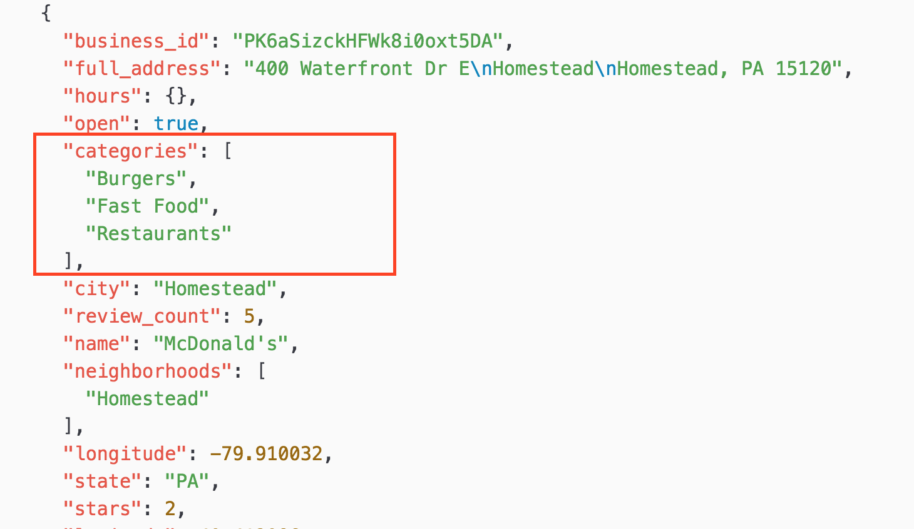

# Week 9

# Midterm project reviews

* See student projects


# Working with Data/APIs



## Data formats

Data can be saved in many kinds of formats.

* CSV - comma separated values
* XML - an older standard
* JSON - Javascript Object Notation
* text file - each line of the file containing a different data point
* a web page

## JSON

JavasScript Object Notation.

JSON is a good standard way of working with data files and is based on how Javascript literal objects are defined.

### JSON Type Examples

#### Basic Example

```
let car = {
  name: 'Saab',
  color: 'red'
  year: 2016
}
```

#### JSON String

```
{ "name":"Ricardo" }
```

#### JSON Number

```
{ "age":77 }
```

#### JSON Object

```
{
  "person":{ "name":"Peter Venkmann", "age":40, "city":"New York" }
}
```

## Accessing JSON with Dot Notation

```
character = { "name":"Shredder", "age":30, "home":"TerrorDome" };

enemy = character.name;
```

## Accessing JSON with Bracket Notation

```
enemy = character["name"];
```

## Nested JSON

Very common!

Example

```
rappers = {
    "Migos": {
        "rapper1":"Offset",
        "rapper2":"Quavo",
        "rapper3":"Takeoff"
    }
 }
```

##### Access data with dot or bracket notation.

```
 let favoriteRapper = rappers.Migos.rapper2;
```

##### Change data value

```
rappers.Migos.rapper2 = "Nardwuar";
```

#### JSON Array

```
let DMSC = {
  "students":[ "Christian", "Felipe", "Giada", "Iwan", "Jonah", "Julian", "Katherine", "Mariafe","Sean","Sundiatta","Tyler","Wyatt" ]
};

function setup(){
  let firstStudent = DMSC.students[floor(random(DMSC.students.length))]; //
  print(firstStudent);
}
```

#### Loading JSON with P5DOM

```
function preload(){
    catBreeds = loadJSON("catBreeds.json"); //can also be a URL online
}

function setup(){
  fill(catBreeds.manx.col);
  text(catBreeds.manx.name, 100, 200);
}
```

# Resources
* [W3Schools JSON intro](https://www.w3schools.com/js/js_json_intro.asp)
* Darius Kazemi's [Corpora](https://github.com/dariusk/corpora) are mostly JSON files

## Application Programming Interface / APIs


We know how to access, parse and modify JSON data. Now we'll look at how we can use functions and API calls to access JSON data on the web.

## Callbacks
* used in asynchronous programming
* when data is finally loaded, THEN call (run) another function

example

```
loadJSON("data.json", dataReceived);

function dataReceived(){
  //once data has been loaded, the callback code in here will run
}
```

## Accessing JSON locally and via URLs

```loadJSON("astros.json", dataReceived);```

VS

```loadJSON("http://api.open-notify.org/astros.json", dataReceived);```

Your JSON file can be local or it can be on another server (at a different URL).

## JSONP to solve cross-domain errors

Sometimes when working with JSON APIs you can get the following error

```
XMLHttpRequest cannot load http://external-domain/service. No ‘Access-Control-Allow-Origin’ header is present on the requested resource. Origin ‘http://my-domain’ is therefore not allowed access.
```

#### Why?

* a web browser may only allow scripts on page A to access data on page B if these two pages have the same origin
* determined by url and port number
* It prevents scripts from reading data from your domain and sending it to their servers
* JSONP helps by pinging the server and returning JSON data wrapped in a function call with callback
* much more detailed info can be found [here](https://www.sitepoint.com/jsonp-examples/)
* Info on using JSONP in P5JS can be found [here](https://p5js.org/reference/#/p5/loadJSON)

## API

* API = application programming interface
* an interface for different pieces of software to communicate together over networks
* created by orgs, programmers, companies to access their data
* there are open APIs and those requiring authorization
* start out by using APIs that have tutorials or sample code and consider trying out ones that don't require authorization

## Working with an API - the basics

## An example - OpenWeatherMap

* using the [OpenWeatherMap](https://openweathermap.org/api) API
* Sign up and make a new account
* Get your private API key

**IMPORTANT**

Do not post your API key online anywhere publicly! This includes on GitHub.

When working with APIs, they often have a specific way of constructing a URL to access specific data.

###### Example

```
website.org/?city=London
```

###### Multiple query values

```
website.org/?city=London&?date=today
```

*These are name-value pairs.*

## How to access OpenWeatherMap

Construct the URL properly

```api.openweathermap.org/data/2.5/weather?q=London&APPID=001b0f58045147663b1ea518d34d88b4```

* Note: replace the APPID with your own ID

You can put this URL in your browser to see this data.

* You may want to use the JSON Formatter Chrome extension to format this data and make it easier to read.
* Or use Code Beautify [JSON Viewer](https://codebeautify.org/jsonviewer)

## Resources

* Blog [post](https://shkspr.mobi/blog/2016/05/easy-apis-without-authentication/) with a few chosen easy-to-use open APIs
* [List](https://gist.github.com/afeld/4952991) of source data APIs that do not require authorization or credentials
* [Public APIs](https://github.com/toddmotto/public-apis) - a large list

Dan Shiffman [tutorial video](https://www.youtube.com/watch?v=bjULmG8fqc8&list=PLRqwX-V7Uu6b36TzJidYfIYwTFEq3K5qH) on Intro to Node - Websockets and p5.js


JSON

[W3Schools intro to JSON](https://www.w3schools.com/js/js_json_intro.asp)


# Homework

## Reading/Watching

* Read [From Paint To Pixels](https://www.theatlantic.com/entertainment/archive/2015/05/the-rise-of-the-data-artist/392399/): The Rise of the Data Artist
* Read [Making Art out of Earthquakes](https://www.theatlantic.com/technology/archive/2013/03/making-art-out-of-earthquakes/274345/)
* Watch Dan Shiffman tutorials on Intro to Node - Websockets and p5.js
  - 12.1 - [Intro to Node](https://www.youtube.com/watch?v=bjULmG8fqc8&list=PLRqwX-V7Uu6b36TzJidYfIYwTFEq3K5qH&index=1)
  - 12.2 - [Using Express with Node](https://www.youtube.com/watch?v=2hhEOGXcCvg&list=PLRqwX-V7Uu6b36TzJidYfIYwTFEq3K5qH&index=2)
  - 12.3 - [Connecting client to server with Socket.io](https://www.youtube.com/watch?v=HZWmrt3Jy10&list=PLRqwX-V7Uu6b36TzJidYfIYwTFEq3K5qH&index=3)
  - Watch [Intro to NPM](https://www.youtube.com/watch?v=s70-Vsud9Vk&nohtml5=False)


## Assignment

- Explore some web projects that use data in creative and interesting ways. Choose one to research in detail and write about your discoveries. Things to consider:
    - Where does the data come from?
    - What technologies are used to retrieve the data?
    - Is the data updated in real time?
    - What technologies are used to present the data?
    - What is the creator trying to make the data tell us?

- Create a sketch that either uses data from an external source or uses a database in some way. Come up with a novel way of presenting the data that your sketch is retrieving.


## Resources

- [Global Map of Wind](https://earth.nullschool.net/)
- [Applying face-recognition to bitmapped visualizations of Bitcoin transactions](http://show.robmyers.org/blockchain-aesthetics/bitcoin-html5/transactions-faces.html)
- [Real-time, global air traffic](https://planefinder.net/)
- [Listening to Wikipedia](http://listen.hatnote.com/)
